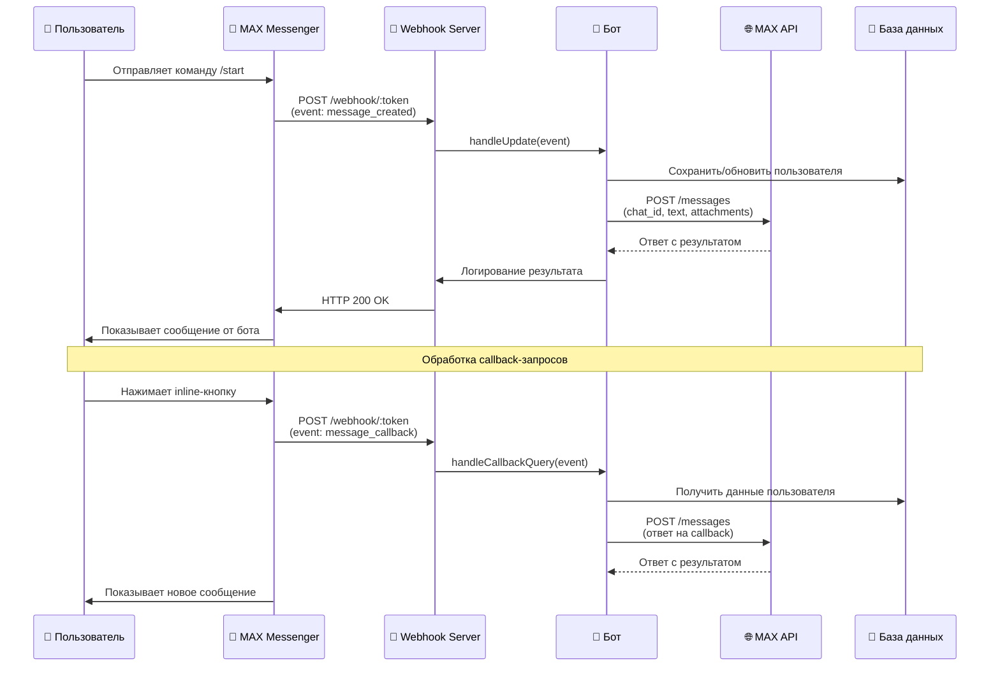
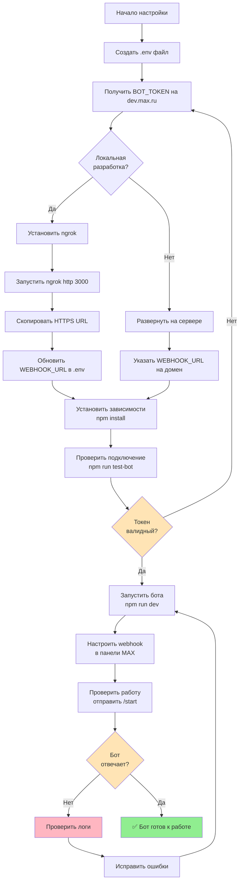
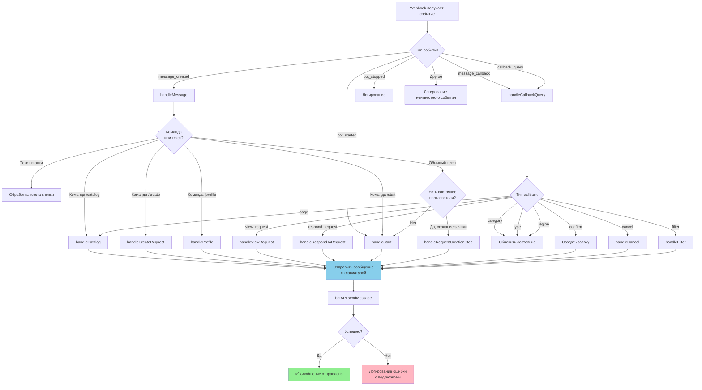
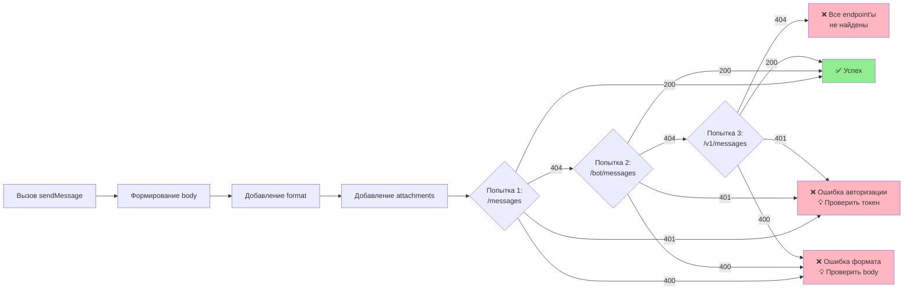

# Добро в MAX - Бот для мессенджера MAX

Бот для мессенджера MAX, который объединяет волонтёров и социальные организации. Платформа позволяет создавать заявки на помощь, откликаться на них и находить единомышленников для добрых дел.

## 🚀 Возможности

- 📋 **Каталог заявок** - Просмотр всех активных заявок на помощь
- ➕ **Создание заявок** - Простой процесс создания новых заявок с выбором категории, типа и региона
- ✋ **Отклик на заявки** - Возможность откликнуться на интересующие заявки
- 👤 **Профиль пользователя** - Просмотр своих заявок и откликов
- 🔍 **Фильтрация** - Фильтрация заявок по категориям, регионам и типам
- 🏷️ **Категории** - Инклюзия, Экология, Здоровье, Культура, Образование, Социальная помощь, Спорт, Животные
- 🔘 **Inline-клавиатуры** - Интерактивные кнопки для удобной навигации

## 📋 Требования

- Node.js 18+ (для локальной разработки)
- Docker и Docker Compose (для запуска через контейнер)
- Токен бота от MAX (получите при регистрации бота в панели управления)

## 🛠️ Установка и запуск

### Вариант 1: Запуск через Docker (Рекомендуется)

#### 1. Клонируйте репозиторий

```bash
git clone <repository-url>
cd DOBRO_V_MAX
```

#### 2. Создайте файл `.env`

```bash
cp .env.example .env
```

Или создайте файл `.env` вручную:

```env
BOT_TOKEN=your-bot-token-here
WEBHOOK_URL=https://your-domain.com
MAX_API_URL=https://platform-api.max.ru
PORT=3000
DB_PATH=./data/dobro.db
```

**Важно:** 
- Замените `your-bot-token-here` на ваш реальный токен бота от MAX (получите на https://dev.max.ru)
- Для локальной разработки используйте ngrok для получения публичного URL (см. раздел "Локальная разработка")

#### 3. Соберите Docker-образ

```bash
docker build -t dobro-max-bot .
```

#### 4. Запустите контейнер

```bash
docker run -d \
  --name dobro-max-bot \
  -p 3000:3000 \
  --env-file .env \
  -v $(pwd)/data:/app/data \
  dobro-max-bot
```

Или используйте Docker Compose (создайте `docker-compose.yml`):

```yaml
version: '3.8'

services:
  bot:
    build: .
    container_name: dobro-max-bot
    ports:
      - "3000:3000"
    env_file:
      - .env
    volumes:
      - ./data:/app/data
    restart: unless-stopped
    healthcheck:
      test: ["CMD", "node", "-e", "require('http').get('http://localhost:3000/health', (r) => {process.exit(r.statusCode === 200 ? 0 : 1)})"]
      interval: 30s
      timeout: 3s
      retries: 3
```

Запуск:

```bash
docker-compose up -d
```

#### 5. Проверьте работу бота

```bash
# Проверка health check
curl http://localhost:3000/health

# Проверка подключения к MAX API
docker exec dobro-max-bot npm run test-bot
```

### Вариант 2: Локальная разработка

#### 1. Установите зависимости

```bash
npm install
```

#### 2. Настройте переменные окружения

Создайте файл `.env` (см. выше).

#### 3. Проверьте подключение к API

```bash
npm run test-bot
```

#### 4. Запустите бота

```bash
# Режим разработки (с автоперезагрузкой)
npm run dev

# Или для продакшна
npm start
```

**Для локальной разработки:** Используйте ngrok или подобный сервис для создания публичного URL для webhook:

1. Установите ngrok: https://ngrok.com
2. Запустите ngrok:
   ```bash
   ngrok http 3000
   ```
3. Скопируйте HTTPS URL (например: `https://abc123.ngrok.io`)
4. Обновите `WEBHOOK_URL` в `.env` на полученный HTTPS URL
5. Перезапустите бота

## 📡 Настройка Webhook

После запуска бота и настройки `WEBHOOK_URL`, установите webhook через панель управления MAX:

1. Зайдите в панель управления ботом на https://dev.max.ru
2. Укажите webhook URL: `https://your-domain.com/webhook/YOUR_BOT_TOKEN`
3. Сохраните настройки

**Важно:** Webhook URL должен быть доступен извне по HTTPS. Убедитесь, что сервер отвечает на `/health` endpoint.

## 📊 Архитектура взаимодействия

Диаграмма последовательности, показывающая как работает отправка сообщений:



## 🔄 Процесс настройки бота



## 🔀 Обработка событий в боте



## 🔄 Процесс отправки сообщения



## 🏗️ Структура проекта

```
.
├── server.js              # Главный файл сервера (Express)
├── config.js              # Конфигурация приложения
├── Dockerfile             # Docker-образ для контейнеризации
├── requirements.txt       # Список зависимостей с версиями
├── package.json           # Node.js зависимости
├── .env.example           # Пример файла с переменными окружения
├── bot/
│   ├── api.js             # API клиент для MAX Bot API
│   ├── handlers/          # Обработчики команд и событий
│   │   └── index.js
│   ├── keyboards/         # Генераторы клавиатур (кнопок)
│   │   └── index.js
│   ├── messages/          # Шаблоны сообщений
│   │   └── index.js
│   └── database/          # Работа с базой данных SQLite
│       └── index.js
├── scripts/               # Вспомогательные скрипты
│   ├── setup-webhook.js   # Установка webhook
│   └── test-bot.js        # Тестирование подключения к API
└── data/                  # База данных SQLite (создается автоматически)
```

## 📝 Команды бота

- `/start` - Главное меню и приветствие
- `/catalog` или `/каталог` - Просмотр каталога заявок
- `/create` или `/создать` - Создание новой заявки
- `/profile` или `/профиль` - Просмотр своего профиля
- `/help` или `/помощь` - Справка по использованию бота

## 🔧 API Endpoints

- `POST /webhook/:token` - Webhook для получения обновлений от MAX
- `GET /health` - Проверка работоспособности сервиса
- `GET /` - Информация о сервисе

## 🗄️ База данных

Бот использует SQLite для хранения данных. База данных автоматически создается при первом запуске в директории `data/`.

**Таблицы:**
- `users` - Пользователи бота
- `requests` - Заявки на помощь
- `responses` - Отклики на заявки
- `user_states` - Состояния пользователей (для многошаговых процессов)

## 🐳 Docker

### Сборка образа

```bash
docker build -t dobro-max-bot .
```

### Запуск контейнера

```bash
docker run -d \
  --name dobro-max-bot \
  -p 3000:3000 \
  --env-file .env \
  -v $(pwd)/data:/app/data \
  dobro-max-bot
```

### Просмотр логов

```bash
docker logs -f dobro-max-bot
```

### Остановка контейнера

```bash
docker stop dobro-max-bot
docker rm dobro-max-bot
```

## 📦 Развертывание

### Heroku / Railway / Render

1. Установите переменные окружения в панели управления:
   - `BOT_TOKEN`
   - `WEBHOOK_URL`
   - `MAX_API_URL` (по умолчанию: `https://platform-api.max.ru`)
   - `PORT` (обычно устанавливается автоматически)

2. Укажите `WEBHOOK_URL` на ваш домен

3. После деплоя установите webhook через панель управления MAX

### VPS / Сервер

1. Установите Docker на сервере
2. Склонируйте репозиторий
3. Создайте `.env` файл
4. Запустите через Docker (см. выше)

## 🧪 Тестирование

### Проверка подключения к MAX API

```bash
npm run test-bot
```

### Проверка health check

```bash
curl http://localhost:3000/health
```

### Тестирование бота

1. Найдите вашего бота в мессенджере MAX
2. Отправьте команду `/start`
3. Проверьте работу всех команд

## 🔒 Безопасность

- Токен бота хранится в переменных окружения (`.env`)
- Webhook URL защищен токеном в пути
- База данных хранится локально
- Docker-образ запускается от непривилегированного пользователя

## 📄 Лицензия

MIT

## 🤝 Вклад

Приветствуются любые улучшения и предложения!

## 📖 Документация MAX

- [Документация MAX Bot API](https://dev.max.ru/docs/api)
- [Правила создания чат-ботов](https://dev.max.ru/docs/legal/rules)

## 🐛 Известные проблемы

- Для локальной разработки требуется публичный URL для webhook (используйте ngrok)
- База данных SQLite не подходит для высоконагруженных систем (для продакшна рекомендуется PostgreSQL)

## 🔧 Устранение неполадок

### Бот не отправляет сообщения

1. **Проверьте токен:**
   ```bash
   npm run test-bot
   ```
   Если видите ошибку 401 - токен неверный. Получите новый токен на https://dev.max.ru

2. **Проверьте логи:**
   ```bash
   # Если используете Docker
   docker logs -f dobro-max-bot
   
   # Или при локальном запуске
   npm run dev
   ```
   Ищите сообщения об ошибках в логах

3. **Проверьте webhook:**
   - Убедитесь, что webhook URL доступен извне
   - Проверьте, что webhook настроен в панели MAX
   - Проверьте, что сервер отвечает: `curl http://localhost:3000/health`

4. **Проверьте формат запроса:**
   - В логах будут подробные сообщения об ошибках
   - Бот автоматически пробует разные варианты API endpoint'ов
   - Если видите ошибку 400 - проверьте формат данных в логах

### Callback-кнопки не работают

- Убедитесь, что в логах видно событие `message_callback` или `callback_query`
- Проверьте формат клавиатуры в `bot/keyboards/index.js`
- Бот автоматически обрабатывает оба формата событий

### Webhook не получает события

- **Проверьте, что WEBHOOK_URL не localhost:** Бот выведет предупреждение при запуске, если webhook URL указывает на localhost
- **Используйте ngrok для локальной разработки:** `ngrok http 3000` и обновите `WEBHOOK_URL` в `.env`
- **Проверьте настройки в панели MAX:** Webhook должен быть настроен в панели управления ботом
- **Проверьте логи:** При получении события от MAX в логах появится сообщение о типе события

## 📞 Поддержка

При возникновении проблем:
1. Проверьте логи: `docker logs -f dobro-max-bot` или `npm run dev`
2. Убедитесь, что токен бота правильный: `npm run test-bot`
3. Проверьте, что webhook URL доступен извне (не localhost!)
4. Проверьте раздел "Устранение неполадок" выше
5. Убедитесь, что webhook настроен в панели MAX на правильный URL

